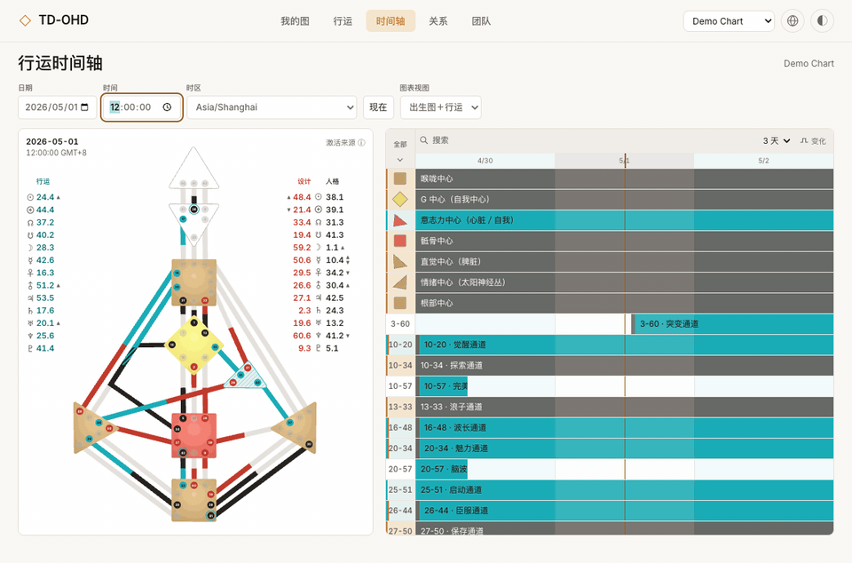
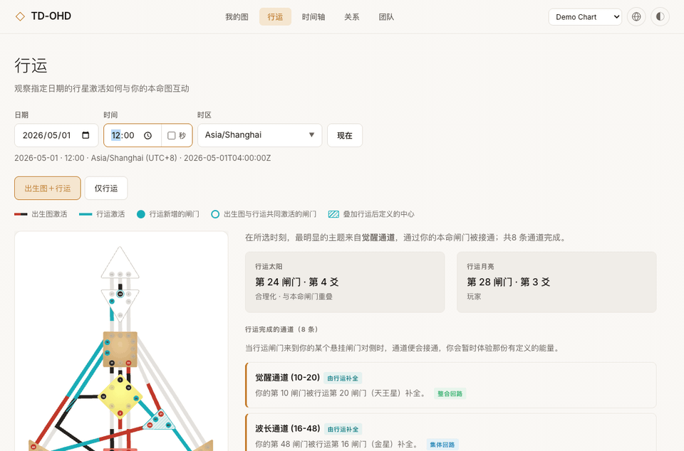

# TD Open Human Design (TD-OHD)

[English](README.md) · [简体中文](README.zh-CN.md)

**A personal fork of [Open Human Design](https://github.com/Unforced-Dev/open-human-design), with browser WASM birth and transit calculation, precise transit controls, an interactive timeline, and English, Simplified Chinese, and Traditional Chinese interfaces.** TD Open Human Design (TD-OHD) is the current working name.

**[GitHub Pages site](https://nothingnessvoid.github.io/TD-OHD/)** · [Legacy Netlify deployment](https://td-ohd.netlify.app/) (kept as historical/backup)

The initial 2026-10-01 release migrated birth charts and added appearance controls and natal Variable arrows. The current migration completes the transit and timeline calculation paths using the same SharpAstrology core; see the [engine migration guide](docs/SHARP_ENGINE_MIGRATION.md) for architecture, reproduction, and verification status. The [earlier release notes (Chinese)](docs/releases/web-2026-10-01.md) describe that historical release, not this migration. Pushes to `main` now publish GitHub Pages automatically once the deploy workflow passes; the legacy Netlify app is no longer updated from this repository.

The original project provides interactive Human Design charts, including the bodygraph, planetary activations, Type, Strategy, Authority, Profile, Variable/PHS, Incarnation Cross, transits, relationship charts, and team analysis. This fork builds on that foundation rather than claiming those features as new work.

## What this fork adds

- **Shared birth and transit engine:** SharpAstrology.HumanDesign 1.2.0 with SharpAstrology.SwissEph 0.5.1 and file-based Swiss Ephemeris, running in .NET 10 browser WebAssembly. Current transits, timeline snapshots, and native annual-event generation share the C# transit core. Gene Keys, relationship/Connection analysis, and Penta team analysis are local derived modules; topology, display vocabulary, readings, and SVG geometry are local static data. The former NatalEngine dependency and its seconds patch are removed. This does not certify all historical dates or calculation accuracy.
- **Appearance controls:** light/dark themes, Classic/Chakra center palettes, and six persistent global settings for accent, Personality, Design, Transit, graph background, and gate number size. Custom settings follow you across both themes and palettes; Classic/Chakra changes only center colors.
- **Natal Variable arrows:** Determination and Environment on the Design side, Motivation and Perspective on the Personality side, with direction taken from the calculation contract. Transit and relationship graphs do not receive natal arrows.

- **Precise transits:** choose a date, time down to seconds, and timezone; handle historical offsets and daylight-saving transitions.
- **More ways to explore transits:** natal-plus-transit and transit-only views, channel and center interactions, and an interactive [transit timeline](docs/transit-timeline.md).
- **Bodygraph interaction fixes:** improved connection paths, hover behavior, tooltip clipping, and gate/channel detail navigation.
- **Localization:** switch between English, Simplified Chinese, and Traditional Chinese. A saved language choice takes priority; otherwise the app follows a supported browser language and falls back to English. See the [localization guide](docs/localization.md) and [Chinese terminology glossary](docs/术语对照表.zh-CN.md).

## See it in action

These short recordings use an isolated browser and a synthetic chart named **Demo Chart**; they contain no saved personal profiles.

**Transit timeline:** drag across the activation tracks to change the selected instant, switch to a 24-hour range, and open an activation detail.



**Transit modes:** switch between the birth-chart overlay and transits alone.



## Privacy and hosting

The [GitHub Pages site](https://nothingnessvoid.github.io/TD-OHD/) and the [legacy Netlify deployment](https://td-ohd.netlify.app/) are static deployments. Chart calculations run in the browser, saved people stay in that browser's local storage, and neither deployment has the local desktop password/SQLite service. Shareable chart links contain birth data in the URL, so share them deliberately. The upstream project's optional hosted MCP and account services are separate from these deployments.

The same source tree also has an **optional local desktop mode** with a password-protected SQLite library. It is included in the repository for maintainability but excluded from the Pages bundle. The database and credentials live outside the checkout on the user's computer. See [local desktop mode](docs/LOCAL_DESKTOP_OVERLAY.md) for the build boundary and update procedure.

## Run locally

Requires Node.js 20 or newer and the .NET 10 SDK (`dotnet` on PATH, or the `DOTNET` environment variable pointing to it). `dev`, `build`, `build:pages`, and `build:desktop` build the WASM engine first. The first build downloads two pinned Swiss Ephemeris files and verifies their SHA-256 checksums.

```bash
git clone https://github.com/NothingnessVOID/TD-OHD.git
cd TD-OHD
npm install
npm run dev
```

```bash
npm run build:engine
npm test
npm run build:pages
npm run check:pages-bundle
```

Run `npm run build:engine` before direct Node test or annual-generation commands: these use the native .NET client and the verified files in `public/engine/ephe`. There is no install-time engine patch. Birth and transit calculations use [SharpAstrology.HumanDesign](https://github.com/CReizner/SharpAstrology.HumanDesign) and [SharpAstrology.SwissEph](https://github.com/CReizner/SharpAstrology.SwissEph). The packaged ephemeris files cover 1800–2399; this describes the bundled data, not a new product date policy or certification of the full historical range. Missing files produce an error; Moshier and legacy-engine fallbacks are disabled. The first calculation lazily loads the WASM runtime and ephemeris files from the same website. See [third-party notices](THIRD_PARTY_NOTICES.md) for source and licenses.

Transit time uses minutes by default. Enable **Seconds** for `HH:mm:ss`; turning it off resets seconds to `00`. The **Now** button respects the selected precision. Browser smoke tests can be run with `npm run e2e` while the dev server is running. Annual regeneration and verification commands are documented in the [migration guide](docs/SHARP_ENGINE_MIGRATION.md).

The optional Cloudflare MCP, OG image, and celebrity chart handlers require an explicitly supplied `env.SHARP_ENGINE` host adapter. This migration does not add or deploy a server engine. Those handlers must not silently substitute an old calculator when that adapter is absent; the static Netlify app calculates through browser WASM.

Appearance tokens live in [`src/styles/tokens/`](src/styles/tokens/). The Transit source is `#1af4ff`; the timeline derives a softer track color by mixing 75% of that source with `#445457`. Gate number size defaults to 22 SVG units and can be adjusted from 14 to 30. Source highlights use circles. These settings change presentation, not chart calculations.

## Publishing the website

GitHub Pages is published from `main`. The [`Deploy to GitHub Pages` workflow](.github/workflows/deploy.yml) runs on every push to `main` (and can be re-run by hand with `workflow_dispatch`). It installs dependencies, builds the pinned Sharp runtime, produces the static `build:pages` bundle, runs the full test suite (the release/distribution tests inspect `dist/`, so the build must exist first), checks the bundle excludes the local account client, and runs the required timeline, planetary-detail, and reference browser checks. Only if that whole job passes does the `deploy` job publish, so a failing run never updates the live site. The build always checks out `main`, so only current `main` source is ever built.

GitHub Pages stays configured for **GitHub Actions** because Vite must build the source. The workflow uses a `pages` concurrency group with `cancel-in-progress: false`, so a newer push queues behind an in-progress deployment instead of cancelling it.

The [legacy Netlify deployment](https://td-ohd.netlify.app/) is kept as a historical/backup site. Its deployment is separate from GitHub Pages and is no longer updated from this repository; the repository homepage link still points there. Pushing source no longer changes Netlify.

## Project relationship

This repository is a fork of **[Unforced-Dev/open-human-design](https://github.com/Unforced-Dev/open-human-design)**. The original authors created the core application and chart experience; the changes listed above were developed on top of it. This personal fork keeps its own deployment and documentation. For upstream contributions, review changes against the original repository and submit focused pull requests.

The repository is named **TD-OHD**. The original project remains credited and linked above; this working name can be revised later without changing the project's provenance.
