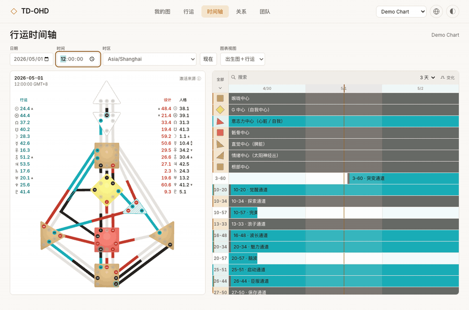
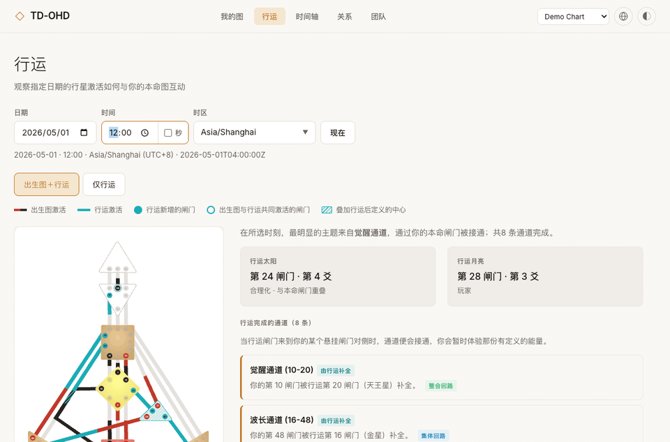

# TD Open Human Design（TD-OHD）

[English](README.md) · [简体中文](README.zh-CN.md)

**这是基于 [Open Human Design 原项目](https://github.com/Unforced-Dev/open-human-design)的个人分叉版本，增加了更精细的行运控制、交互式时间轴，以及英文、简体中文、繁体中文界面。** 当前暂用英文名称 TD Open Human Design，缩写 TD-OHD；暂不展开 TD 的中文含义。

**[打开网页版](https://td-ohd.netlify.app/)** · [GitHub Pages 版本](https://nothingnessvoid.github.io/TD-OHD/)

原项目提供交互式人类图，包括人体图、行星激活、类型、策略、内在权威、人生角色、四箭头／PHS、化身十字、行运、关系合图与团队分析。本仓库在这些已有功能上继续开发，不把原项目的成果写成新增功能。

## 这个分叉增加了什么

- **精细行运：**可选择日期、精确到秒的时间和时区，并处理历史 UTC 时差及夏令时切换。
- **更多行运查看方式：**本命图＋行运、仅行运视图、通道与能量中心交互，以及[行运时间轴](docs/transit-timeline.md)。
- **人体图交互修复：**改进连接路径、悬停跟随、浮窗裁切和闸门／通道详情导航。
- **中文化：**可切换英文、简体中文、繁体中文。手动选择的语言优先；否则跟随支持的浏览器语言，其他语言回退到英文。维护说明见[本地化文档](docs/localization.md)，专业术语见[中文术语对照表](docs/术语对照表.zh-CN.md)。

## 功能演示

下面的动图用独立浏览器和名为 **Demo Chart** 的虚构示例图录制，没有读取已保存的个人资料。

**行运时间轴：**拖动激活轨道选择时刻，切换到 24 小时范围，再查看一项激活的详情。



**行运图表模式：**在“出生图＋行运”和“仅行运”之间切换。



## 隐私与部署

[Netlify 网页版](https://td-ohd.netlify.app/)和 [GitHub Pages 版本](https://nothingnessvoid.github.io/TD-OHD/)都是纯静态部署。图表在浏览器中计算，保存的人物资料留在各自网址对应的浏览器本地存储中；两者都不提供本机桌面版的密码／SQLite 服务。分享图表链接会把出生资料写入网址，请留意分享对象。原项目提供的托管 MCP 和账号服务不属于这些静态部署。

同一套源码还包含**可选的本机桌面模式**，使用密码保护的 SQLite 资料库。这部分代码放在仓库中便于与前端一起维护，但不会进入 Pages 构建包；数据库与密码资料只留在使用者电脑的代码目录之外。构建边界与更新方法见[本机桌面模式说明](docs/LOCAL_DESKTOP_OVERLAY.md)。

## 本地运行

需要 Node.js 20 或更新版本。

```bash
git clone https://github.com/NothingnessVOID/TD-OHD.git
cd TD-OHD
npm install
npm run dev
```

```bash
npm test
npm run build:pages
npm run check:pages-bundle
```

安装时会对 NatalEngine 1.6.0 应用带版本检查的补丁，让行运计算保留秒数。如果安装时禁用了脚本，构建前请手动运行 `node scripts/patch-natalengine-seconds.mjs`。图表计算基于 [NatalEngine](https://github.com/Unforced-Dev/natalengine)。

行运时间默认精确到分钟；开启 **Seconds（秒）** 后可输入 `HH:mm:ss`，关闭时秒数会恢复为 `00`。**现在**按钮会遵循当前精度。修改 NatalEngine 补丁后，可用 `npm run dev -- --force` 刷新 Vite 的依赖缓存。开发服务器运行时可执行 `npm run e2e` 做浏览器冒烟测试。

行运配色集中在 [`src/styles.css`](src/styles.css) 的 `:root` 与 `[data-theme="dark"]` 中。`--transit-source`、`--transit-source-soft`、`--transit-source-contrast` 和 `--transit-source-text` 分别控制行运路径、背景、闸门数字及文字；换皮肤时应同时检查明暗两种主题的对比度。默认行运强调色在浅色模式下为 `#1aadb7`，深色模式下为 `#66c7cc`；回路徽标仍使用自身的分类颜色。

## 网页发布

`main` 分支继续用于源码开发。只有推送专用的 `pages` 分支才会构建并发布 GitHub Pages；合并到 `main` 不会自动改动线上网页。准备上线时，再把审查完成的提交送入 `pages`。[Pages 工作流](.github/workflows/deploy.yml)会运行测试、构建纯静态网页并发布，不启用账号同步后端。由于 Vite 需要构建，GitHub Pages 设置仍使用 **GitHub Actions**；真正触发发布的源码分支只有 `pages`。

## 项目来源与后续贡献

本仓库从 **[Unforced-Dev/open-human-design](https://github.com/Unforced-Dev/open-human-design)** 分叉而来。核心应用与原有图表体验由原项目作者开发；上面列出的调整建立在其工作之上。这个个人版本有独立的部署和说明文档。若要向原项目贡献功能，会单独比对原仓库，并提交范围清晰的 PR。

仓库名现为 **TD-OHD**。上方保留原项目的署名和链接；将来调整暂用名称，也不会改变项目来源。
