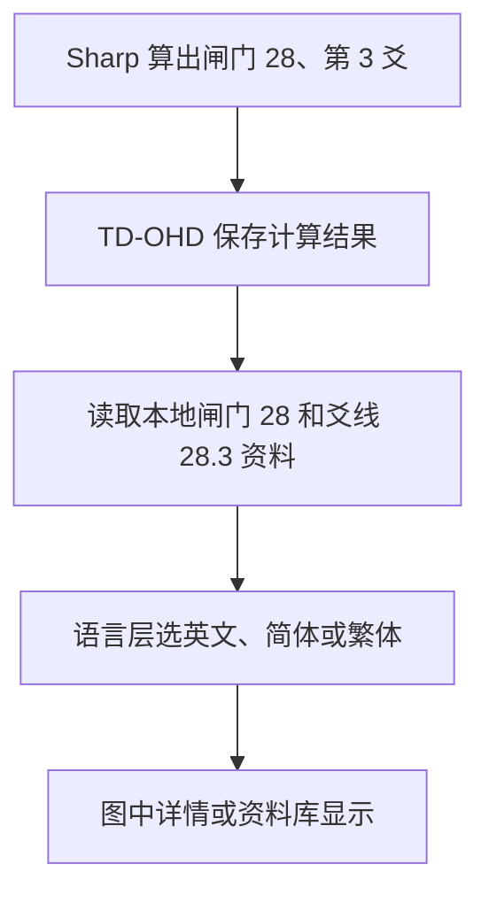

# TD-OHD 文案与知识源地图：阶段 1

审计基线：`main` / `7734b942160497c1c28d46002de0edd91df53230`（PR #13），2026-10-01。已用 GitHub API 核对最新主分支，独立分支为 `audit/content-sources-phase-1`。

本轮只读取产品代码、资料和翻译，新增审计报告与生成脚本。未改正文、计算、页面、关系或团队功能。没有部署或推送。老师教材未提供、未查找、未读取、未引用；仅预留 `teacher-material` / `teacher-extension` 两个来源类型。

## 1. 当前网站计算来自哪里？

| 用户看到的内容 | 实际负责人 |
|---|---|
| 出生时刻、设计时刻的天体位置；闸门、爻、基色、基调、基底 | SharpAstrology + Swiss Ephemeris 文件 |
| 出生图类型、权威、人生角色、定义、化身十字分类、完整通道、中心激活 | SharpAstrology.HumanDesign 1.2.0 |
| 名称、解释正文、关系建议、团队建议 | TD-OHD 仓库中的本地资料和分析代码 |
| 简体及繁体名称和正文 | 本地语言字典与中文资料 |
| 行运叠加、临时定义、桥接岛、时间轴区间、Line Fixing | Sharp 提供激活位置，TD-OHD 本地代码继续推导与显示 |

可简单理解为：引擎算出“28.3”，网站再查资料，得到“这个闸门和这条爻线怎么解释”。这两件事的来源、维护入口和审核要求不同。

## 2. 旧 NatalEngine 还在不在？

当前项目的 `package.json` / `package-lock.json` 不再把 NatalEngine 当作运行时计算依赖。出生图、行运和时间轴的天体计算都走 Sharp。

但是旧资产仍在：64 闸门名称、36 通道、九中心资料、类型/权威/人生角色、英文解读、易经、Gene Keys 关键词，以及从旧包移植的关系、团队、行运结构分析代码。这些已经复制进仓库，运行时不需要安装旧包。依据是 [THIRD_PARTY_NOTICES.md](../../THIRD_PARTY_NOTICES.md) 与实际 import 链。

“来自 NatalEngine”在本报告中表示代码和文件的迁移来源，不表示每段话都来自 Human Design 官方，也不表示曾经经过专业审核。原始文章作者及逐句知识依据，很多仍无法从仓库确认。

## 3. 新 Sharp 引擎直接提供什么，网站又补充什么？

- **直接计算**：两个时刻的 13 点激活、六层数值、类型、8 类原始权威、人生角色、5 类定义、化身十字枚举、通道枚举、中心激活状态。
- **本地补充**：显示名称与解释、中心身体关联、通道主题与回路、Gene Keys 光谱、中文译文。
- **适配层加工**：把枚举映射为本地对象；把中心细分为已定义/未定义/全开放；生成四箭头方向、名称、解释与标准编码；生成十字显示名称及门号组合；计算主要回路与摘要。

尤其需要留意：Sharp 的 `EgoManifested` 和 `EgoProjected` 到网站里都变成 `ego`，中文只有一个意志力/心脏权威。原始细分类别没有保存在最终 chart 中。本轮已记录，未修。

完整逐字段说明见 [adapter-boundary.md](adapter-boundary.md)。

## 4. 一段解读怎样显示出来？



改正文通常不需要改引擎；改引擎也不会自动更新正文。英文和两个中文版本是独立文件，存在不同步的风险。

## 5. 本轮发现了哪些类别？

界面操作、显示词汇、人类图正文、易经、Gene Keys、经络及时间轴扩展、关系分析、团队分析。翻译是独立的一层：一段翻译仍要继承原文的知识类别，不能仅凭 `engine-messages.json` 这个文件名就认为来源是 Sharp。

| 知识对象 | 数量 | 说明 |
|---|---:|---|
| 类型 | 5 | 另有 5 条面向普通用户的简短简介 |
| 网站权威 | 7 | Sharp 原始权威 8 类，网站合并了两种 Ego 权威 |
| 人生角色 | 12 | 名称与主题 |
| 定义 | 5 | 有名称；独立逐类解释正文 0 条 |
| 中心 | 9 | 含已定义、未定义、全开放等正文 |
| 通道 | 36 | 名称、结构、主题及独立正文 |
| 闸门 | 64 | HD 名称与正文，不把易经/Gene Keys 混入 HD |
| HD 爻线 | 384 | 每条单独记录 |
| 易经卦 | 64 | 另有 384 条易经爻义，独立逐条审核 |
| Gene Keys | 64 | 另有 64 组目录关键词光谱与序列映射 |
| 经络 Lens | 64 | 每门一条对应记录，原始外部来源不明 |
| 行星 | 13 | 三语简述；另有 3 个来源说明及 3 个概念正文 |
| 四箭头 | 24 | 4 个类别各 6 条名称与解释；另有 6 个认知名称 |
| 关系类型组合 | 15 | 每组合包含 dynamic / gifts / challenges / tips |
| 团队角色 | 9 | 根据成员中心定义模式生成角色与建议 |

审计记录包括一条对象的原文、翻译、字典键及硬编码候选，因此“记录数量”不等于“独立文章数量”。详尽计数由 [statistics.json](statistics.json) 给出，字段口径如下：

| 指标 | 当前计数 | 统计口径 |
|---|---:|---|
| UI 字典键 | 657 | UI/timeline 字典 source key 与 contextual key；不是全部原文句子数 |
| 审计资产 | 4479 | 包括知识对象、父子对象、语言版本和候选文字；不得合计成正文篇数 |
| 显示词汇记录 | 742 | 含两个中文术语版本及源键，不是去重概念数 |
| 关系文案记录 | 188 | 含字典对象、动态模板和翻译源键 |
| 团队文案记录 | 89 | 含字典对象、动态模板和翻译源键 |
| 来源含 unknown | 314 | 64 条经络 + 250 条无法确定具体文案来源的 AST 候选 |
| 硬编码候选 | 1121 | 全 JS AST 的显示/错误/模板候选；包括技术字符串，需逐项复核 |
| 跨文件完全相同的文字候选 | 353 | 英文 lookup key、镜像资料、父子记录可重复；不直接当问题数 |
| 已确认独立维护重复问题 | 4 | DUP-01 至 DUP-04，详见 issues.md |
| 已确认信息损失问题 | 3 | LOSS-01 至 LOSS-03；包含 C# 序列化和 JS 适配层 |
| 知识内容待专业审校 | 4479 | status=unreviewed，不代表本轮未检查代码读取链 |

## 6. 什么已经共用，什么仍需下一阶段处理？

闸门 HD/爻线/易经/Gene Keys/经络、通道正文、中心详情的主要入口确实共用。中心下方列表仍有自己拼装的展示逻辑；类型、权威和人生角色没有资料库专门条目，不能说这些对象已经“全站统一入口”。复制数据只读取结构与显示词汇，不输出解释长文。

下一阶段优先事项见 [issues.md](issues.md)：权威细分保留、定义资料缺口、Gene Keys 光谱重复、四箭头适配职责、来源未知、回路修正入口差异、关系/团队启发式边界、翻译匹配与 fallback。均未在本轮修复。

## 阅读导航

- [inventory.md](inventory.md)：按对象排列的人读总表，每个 28.3 等对象可单独审核。
- [inventory.json](inventory.json)：原文字段、翻译位置、使用链、来源、状态。
- [source-map.md](source-map.md)：按来源归类。
- [runtime-flow.md](runtime-flow.md)：读取链与“改一处会影响哪里”。
- [adapter-boundary.md](adapter-boundary.md)：原始字段、派生字段、本地附加、硬编码解释。
- [issues.md](issues.md)：只列问题与证据。
- [coverage.md](coverage.md)：扫描范围、运行消费证据和盲区。
- [dependency-map.json](dependency-map.json)：实际 import/export/dynamic import 图、重复候选和季度覆盖差异。
- [validation.md](validation.md)：生成稳定性、产品文件未改和现有测试结果。

## 重复生成

```bash
npm ci
node scripts/audit-content-sources.mjs
```

Node 需支持 JSON import attributes（本轮使用 v26）。脚本使用 Vite 依赖中的 Rollup AST parser；不需要新增依赖。仅生成 inventory.json / inventory.md / dependency-map.json / statistics.json。README 等人工分析文档不会被覆盖。

本轮在阶段 1 结束，不进入第二阶段教材审核或重构。
