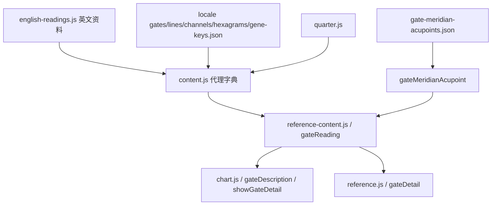

# 真实运行读取链与影响范围

箭头表示实际函数/数据消费。静态 import 可达关系在 dependency-map.json；import 一个模块并不意味着它的每个字段都显示。本表补充逐入口的调用证据。

## 基础语言入口

`locales/index.js → i18n.getLocaleResources()` 选语言。

- UI：`ui-* / ui-contexts → locales/<locale>/index.js.messages → i18n.t / translatePage / setMessage`。
- 时间轴 UI：`messages.js.en + locale.timeline.messages → translator → 时间轴与共享 graph-window`。
- 知识正文：`display-data → content.js 的代理字典 → locale.content.data`；中文对象缺失时 fallback 到英文对象。
- source-key 正文：`contentText → locale.content.text → createChineseReadings.text`；未匹配保留英文。
- 名称：`vocabulary.js → locale.vocabulary`。与 UI t、正文 contentText 是三个不同入口。
- 本机资料库 UI：`localMode → dynamic import local-account.js → registerMessages(ui-local)`；只有 desktop/local 构建加载。

## Gate / Line / I Ching / Gene Keys / Meridian

| 对象 | 精确读取点 | 展示位置 | 已真正共用？ |
|---|---|---|---|
| HD Gate | GATE_DESCRIPTIONS[n].keynote/description | 图的门弹窗、资料库门详情 | 是，gateReading(hd) |
| HD Line | LINE_DESCRIPTIONS[n][line].keynote/description | 门弹窗六爻、资料库 line 深链 | 是，selectedLine/activeLines 只改变筛选和强调 |
| I Ching | HEXAGRAM_DESCRIPTIONS[n].meaning/lines；hexagramName | 两处的 iching Lens | 是；Gate.iching 别名与卦正文名称仍分开保存 |
| Gene Keys | GENE_KEY_DESCRIPTIONS[n].shadow/gift/siddhi/description | 两处 gk Lens | 是；geneKeyTerm 中文带英文原词 |
| 经络 | JSON → gateMeridianAcupoint(n) | 两处 meridian Lens | 是；直接读取中文记录，没有 locale 翻译分支 |

Gate 的 quarter 由 content.js 每次读取代理时用 quarterForGate 覆盖，不更改原始 JSON/JS。41 门的存储季度与实际读取季度不同，详见 dependency-map.json 的 quarterDifferences。

## Channel

`catalog.CHANNELS` 提供结构与短主题；`english-readings.CHANNEL_DESCRIPTIONS / locale.channels.json → content.js → channelReading(id) → chart.showChannelDetail / reference.channelDetail`。

共用的是 description / whenDefined 正文。出生图通道列表显示 ch.theme；这是另一种短文本，不能与长正文混计。回路显示还经过 circuit-topology.channelCircuit，而 adapter 主要回路统计直接读 catalog 的 circuit。

## Center

`catalog.CENTERS → contentText`，中文由 engine-messages 和 vocabulary 的中心名称覆盖。

- `centerReading(id,{status}) → 图中 center detail`；`centerReading(id) → 资料库 centerDetail`。
- 出生图下方 center 列表在 chart.renderCentersPanel 自己拼 defined/undefined/open 文本和非自己问题，仍读取同一个 CENTERS 对象；没有复制第二份正文文件。
- center 详情、资料库、列表字段覆盖不同：资料库主要展示 theme/biological 与三态正文；图详情还显示 activatedGates / notSelfQuestion。此处是不同消费，不是两个正文源。

## Type / Authority / Profile

`Sharp raw 枚举/号码 → sharp-contract → catalog 对象 → chart 基础信息`。

`typeName/strategy/notSelf/signature/authorityName/profileName → vocabulary.js → en.js 或中文 vocabulary.js`；`chart.type.description / authority.description / profile.theme → contentText`。

另有 `en.TYPE_PLAIN / zh.TYPE_PLAIN_ZH → typeDescription → chart 顶部介绍`。这是独立简短正文，不是 catalog.description 的同一版本。关系/团队也消费类型名称、策略或权威/角色信息；没有 Type/Authority/Profile 专属资料库条目。

## Definition

`Sharp raw.definition → definitionNames → chart.definition → definitionName → 基础卡、顶部、复制数据`。

无定义正文 dictionary。`channels → bridge.natalIslands → bridgeState → graph-provider.stateAt → timeline bridgeCount` 提供固定本命岛的连接事实。关系的 analyzeBridging 则提供自定义“Light/Significant/Intense bridging”说明，不能把两者混为同一知识对象。

## Variable

`Sharp 两侧太阳/北交点 C/T/B → sharp-contract.makeVariable → tone 定方向、color 查 variableNames/Descriptions → chart`。

- 图的箭头和基础四字母卡：variable-arrows + i18n 标签，只显示方向/分组。
- 详细说明区：`variable(slot)[0]` 给本地化名称；`contentText(slot.description)` 给正文；cognition 用 vocabulary。当前 zhVariable 的第二返回值只是原 slot.description，没有另一套说明字典。
- 复制：`variable(slot)[0]` + 方向/C/T，不读取 description。

因此 Variable 正文实际是 adapter 原句加 engine-messages 的译文，共用 slot.description；名称则在 vocabulary 与 engine-messages 两套入口都存在，例如 Appetite 分别译为“食欲型”和“食欲”。

## Gene Keys：计算映射与正文分开

`Sharp chart → calculateGeneKeys → GENE_KEY_SPECTRUM → 球位/序列对象`。

| 输出 | 当前消费 |
|---|---|
| Activation 的 Life's Work / Evolution / Radiance / Purpose | chart.renderCrossPanel 显示四张卡，关键词优先 geneKeyTerm |
| Venus: Attraction / IQ / EQ / SQ | 生成对象，但当前没有完整序列页面 |
| Pearl: Vocation / Culture / Pearl | 生成对象，但当前没有完整序列页面 |
| Core / Brand / pathways / allKeys / summary | contract 保留；主图未显示完整解读 |
| description 长文 | 门的 Gene Keys Lens，而非 Activation 四卡 |

关键词有两份：catalog.GENE_KEY_SPECTRUM 与 english-readings.GENE_KEY_DESCRIPTIONS，Activation 主显示优先后者，sphere 光谱作 fallback。这是 DUP-01。

## 行星与 Personality / Design / Transit

`planet-reference.summaries → planetReference`；`sources → activationSourceReference`；`concepts → activationConceptReference`。三语在同一个 JS 字典中。

`chart.showPlanetDetail` 显示选定行星+来源简述；资料库 planetDetail / conceptDetail 消费相同函数。出生图下方行星激活介绍则是 chart.js 的 UI source-key 长句（“约 88 天”），与独立概念正文（88°太阳弧）不是同一份内容。

## 行运、时间轴及 fixing

`Sharp activations → analyzeTransitActivations → renderTransitSummary`：统计/结构为代码结果，补全提示为 UI 模板，reinforcedGates.meaning 为分析模块拼句并在展示端替换 today 为 selected time。fixed source-key 匹配涉及 engine-templates。

`Sharp snapshots/annual events → timeline engine/provider → graph-provider → buildTransitGraph/bridgeState → intervals → timeline.view`；图窗由共享 graph-window.js 渲染。

`LINE_FIXING_PLANETS → calculateLineFixings/calculateTransitLineFixings → graph-window fixingMark`；tooltip 的 natal/temporary labels 来自 timeline messages。规则表注释明确来自 Sharp utility 的事实表（383 条规则，54.4 缺失），不包含 Rave I'Ching 正文。运行时缺规则显示 unknown，不补规则。

## Relationship

`两张 Sharp chart → compareHumanDesign(connection.js) → views/connection.js → contentText + vocabulary + i18n.t`。

结构：共门、共通道、电磁/妥协/主导/伙伴、中心定义关系、合图通道/中心。解释：TYPE_DYNAMICS、authority timing、profile harmony、bridge 分级和 summary。`PROFILE_HARMONY` 的 0.6/0.7/0.75/0.8 是本地启发式，summary 用 ≥0.75 判断“natural harmony”，页面不直接显示数值评分。

## Team

`成员 charts → analyzePenta(penta.js) → views/team.js → contentText / t`。

页面实际展示 groupType/groupCareerType、成员数、中心/通道数、9 个 filled/missing roles、最多前十条电磁连接、recommendations。group structure 是合组推导；角色、职业类别和建议是本地规则附带解释。其余 circuitBalance/sharedGates 等结果不全都展示。代码接受 2–9 人，isPenta 只对 3–5 为 true；不能据错误提示中的 WA 文字声称实现了 Wa 模型。

## Chart Data Export

`chart + 成功渲染的 transit snapshot → formatChartDataExport → 分享按钮 → clipboard`。

读取 typeName/strategy/authorityName/profileName/definitionName/signature/notSelf/centerName/channelName/planetName/variable(name) 与 crossName。这些是本地化词汇及十字名称，不是解释长文。门爻、中心组、通道、四箭头数值直接读 chart；行运时间来自选定快照。没有调用知识正文描述，没有单独维护第三份知识文件，也没有额外计算。

## 非主页面的入口

`worker/seo.js` 直接读取 display-data，内容是英文；与 locale/content reader 不共用。`worker/chart-provider.js` 要显式 host adapter，当前公开静态部署不从 edge 重算。SVG renderer 也有英文固定标签。审计 inventory 包含 worker 源文案候选，但 import 可达不等于当前静态站会执行这些可选 handler。
