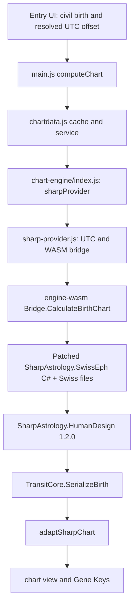
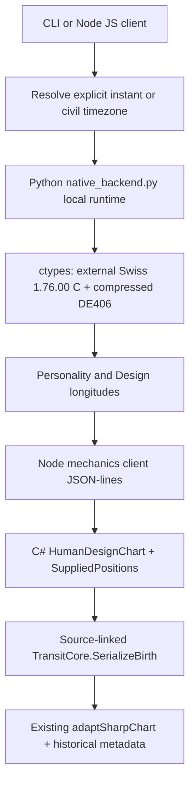

# Current engine call graph

Audit base: `1add60c36b469e0d5dc84bd7ca38b0984a446363`. Paths and line references below describe that base, before the isolated interface extraction in this branch. They are repository source evidence, not an inferred diagram of the intended system.

## Browser Modern path

| Step | Actual source evidence |
| --- | --- |
| Place resolves an IANA zone | `src/lib/location.js:23` performs Open-Meteo place search; `:39-43` retains latitude, longitude and `timezone`. |
| Civil time becomes an offset | `src/views/entry.js:188-231` obtains `offsetForZone`, retains `location.iana`, and submits `birthDate`, `birthTime`, numeric `timezone`, location and unknown-time status. Manual offset is a separate supported route. `src/lib/timezone.js:27` implements existing offset resolution. |
| UI invokes calculation and display | `src/main.js:313` calls `computeChart(resolved)`; `:314` runs sensitivity; `:327` renders. |
| Service and production binding | `src/lib/chartdata.js:5` imports `chartEngine`; `:22-28` asks its cache key and `calculateBirth`. `src/lib/chart-engine/index.js:2-4` binds only `sharpProvider`. |
| UTC and WASM loading | `src/lib/chart-engine/sharp-provider.js:11-19` converts civil minute input plus offset to UTC; `:24-31` loads `engine/_framework/dotnet.js`, creates the runtime and gets `SharpChartEngine.Bridge`; `:35-39` parses JSON and adapts the chart. |
| C# astronomy and chart | `engine-wasm/Program.cs:25-43` parses UTC, ensures required Swiss blocks, creates `SwissEphemeridesService` with `allowMoshierFallback: false`, computes `DesignJulianDay`, creates `HumanDesignChart`, serializes. `:75-101` fetches `.se1` files into `/ephe`. |
| Patched Modern astronomy | `third_party/SharpAstrology.SwissEph/SwissEphemerides.cs:104-146` converts UTC with its calendar service, resolves node/body flags and positions, derives Earth/South Node antipodes. This is a C# port in the browser WASM assembly, not a Python call or the historical C library. |
| Shared HD dependency and serializer | `engine-wasm/SharpChartEngine.csproj:11-14` references engine-core, HD `1.2.0`, and the checked-in Swiss project. `engine-core/TransitCore.cs:74-115` serializes both activation sides plus type, authority, profile, definition, cross, channels and centers. |
| App adaptation | `src/lib/chart-engine/sharp-contract.js:94-148` converts raw output into existing application fields; `sharp-provider.js:48-50` adds Gene Keys. Strategy belongs to the existing `chart.type` presentation data. |

The production provider accepts `HH:MM` (`birth-time.js:1-7`), and unknown time uses noon (`sharp-provider.js:8`). Its current cache is Modern-only and includes `sharp:${ENGINE_SIGNATURE}:adapter-v1` (`:7`, `:44-46`). This audit does not upgrade the browser input precision or change that cache.

## Local Modern CLI path

`scripts/birth-engine-prototype.mjs:2-9` → `BirthEnginePrototype.calculate` (`scripts/lib/birth-engine-prototype.mjs:85-92`) → `SharpNativeClient.birth` (`scripts/lib/sharp-native-client.mjs:77`) → JSON-lines `engine-tools/Program.cs:24-29` → the same patched Swiss C# context, `DesignJulianDay`, `HumanDesignChart`, and `TransitCore.SerializeBirth` → the same `adaptSharpChart`.

The native client builds/starts `engine-tools/SharpTransitGenerator.csproj` (`sharp-native-client.mjs:10-28`), not the browser host. The default CLI engine is `modern` (`scripts/birth-engine-prototype.mjs:5`); `both` returns separate `modern` and `jovianCompatible` results (`scripts/lib/birth-engine-prototype.mjs:87`).

## Local Jovian-compatible path

| Step | Actual source evidence |
| --- | --- |
| Input normalization | `scripts/lib/birth-engine-prototype.mjs:19-49` resolves `utc`/`birthUtc`, civil date/time, IANA zone plus fold, or numeric offset. DST gaps are rejected. City coordinates do not correct astronomy (`:47`). |
| Required Python subprocess | `:94-96` requires an external historical runtime and synchronously invokes `jovian-engine/native_backend.py --runtime … --utc-jd …`. Python is a current local runtime dependency. |
| Native code and data identity | `jovian-engine/native_backend.py:44-115` verifies pinned assets, source, instrumentation and native library; `:75-96` loads C via `ctypes.CDLL`, binds `swe_calc`, `swe_calc_ut`, and sets the DE406 directory. Historical version must equal `1.76.00`; fallback is rejected (`:117-130`). |
| Astronomy | `native_backend.py:164-187` evaluates Personality through `swe_calc_ut` with civil UTC's numeric JD under legacy UTC-as-UT1 semantics, converts to TT using historical delta-T, solves the 88° Design root (`:147-162`), and computes Design using `swe_calc`. `:133-145` produces 13 bodies with Earth/South Node antipodes. |
| JS to C# host | `birth-engine-prototype.mjs:53-72` builds and starts `JovianMechanics.dll`; `:79-83` sends exact positions plus birth/design identity labels. |
| Reused HD mechanics | `jovian-engine/mechanics/Program.cs:15-21` creates `SuppliedPositions`, calls `HumanDesignChart` and serializes. `:26-36` returns supplied longitude/speed without resampling. `JovianMechanics.csproj:4-6` uses HD `1.2.0` and source-links `../../engine-core/TransitCore.cs`; it does not link Modern astronomy. |
| Result and identity | `birth-engine-prototype.mjs:97-102` adapts the serialized chart, replaces the Modern ephemeris label with historical metadata, and returns raw/chart/astronomy/engine identity. `:13-16` hashes shared integration sources into the historical signature. |

Historical `designModelUt1Jd` / `designModelNumericClock` is an inverse numeric UT1 clock, explicitly **not asserted civil UTC** (`native_backend.py:178-182`). A millisecond DateTime label supplied to HD mechanics identifies the side; Design astronomy continues to use the binary64 TT root and original longitudes. Existing display-derived position fields must not replace those authoritative longitudes.

## Evidence limits

This traces repository host calls and package/project references. The shared HD implementation is the pinned NuGet dependency, not newly implemented in this branch. Golden fixtures and the research oracle are validation inputs, never a chart provider. Numerical no-change claims require this branch's fresh [validation.json](validation.json).
