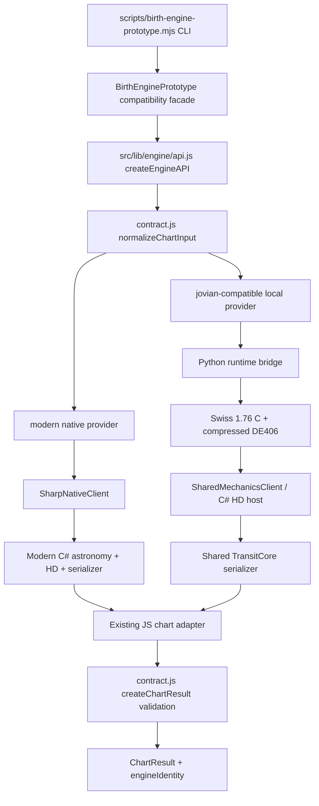
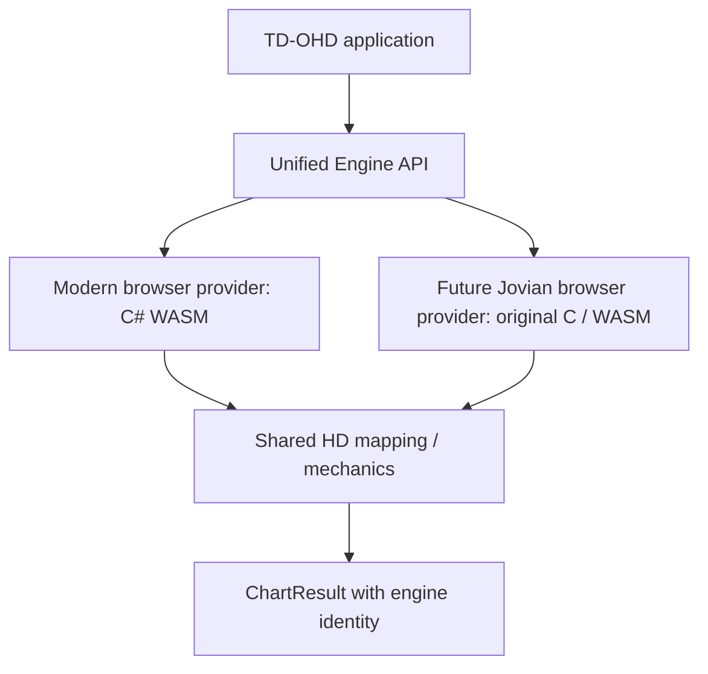

# Target engine call graph

## Implemented in this branch

`src/lib/engine/contract.js` and `api.js` contain no Node/native transport imports. `scripts/lib/birth-engine-providers.mjs` owns Node/native imports, provider lifetimes and astronomy-specific metadata. `scripts/lib/shared-mechanics-client.mjs` owns the existing local HD subprocess protocol. `scripts/lib/birth-engine-prototype.mjs` delegates to this API and re-exports the former helper names for existing CLI/validation users.

The common API defaults to `modern`. `both` runs each registered provider and returns `{ modern, jovianCompatible }`, with independent results and identities. Missing providers fail explicitly; there is no automatic fallback to another engine. The API is a real shared dispatch and result validation interface used by both local providers. It does not require the two astronomy implementations to use the same language.

## Existing production path

Browser UI → `chartdata.js` → `chart-engine/index.js` → `sharpProvider` → Modern .NET WASM remains the actual website path. The new contract and dispatch are available for browser-safe imports, but the production binding is not migrated in this round. Local Node providers must never be imported into the browser application.

## Future application integration

The second diagram is an integration target, not a delivered browser implementation. A browser Modern adapter could wrap the existing WASM host. Jovian requires separately validated C/WASM hosting and integration, without Python. No engine selector is implied by the presence of this diagram.

No large directory rename is needed. The present equivalent conceptual structure is: contract under `src/lib/engine`; production Modern under `src/lib/chart-engine`, `engine-wasm`, and patched Swiss source; local Jovian under `jovian-engine`; shared mechanics under pinned HD package and `engine-core`; local provider transports under `scripts/lib`; acquisition/build under scripts and `prepare_native.py`; validation under tests/scripts with independent research evidence.
